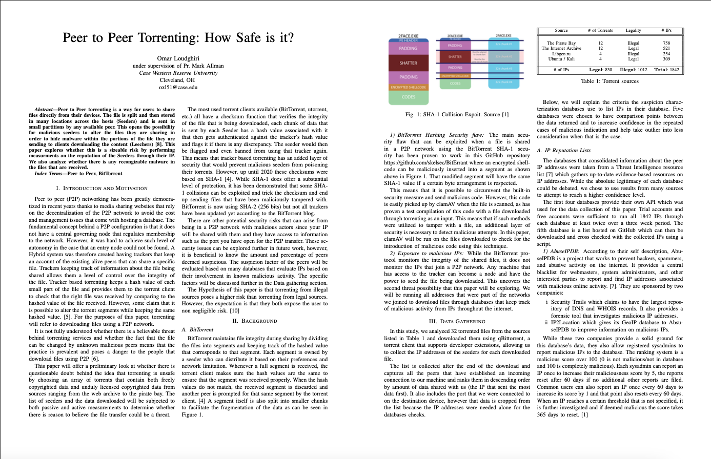

# Network Measurment Project 
This is the repository for all my data collection code and the [Paper](/Paper_Omar_Loudghiri.pdf) that was written for CSDS 600: Network Measurment
and Analysis as a semester long project.

# Abstract

Peer to Peer torrenting is a way for users to share files directly from their devices. The file is split and then stored in many locations across the hosts (Seeders) and is sent in small partitions by any available peer. This opens the possibility for malicious seeders to alter the files they are sharing in order to hide malware within the portions of the file they are sending to clients downloading the content (Leechers) [8]. This paper explores whether this is a sizeable risk by performing measurments on the reputation of the Seeders through their IP. We also analyze whether there is any recongizable malware in the files that are received.

# Tools used 

- Traceroute
- WireShark
- ping
- nslookup
- matplotlib
- zmap
- T-Pot

# Future Work

While this paper paved the way for me to get familiar with the network measurment world, it has pushed my interest to pursue a Master's in the field which aims to have a more comprehensive paper able to be published in an IMC conference. 
